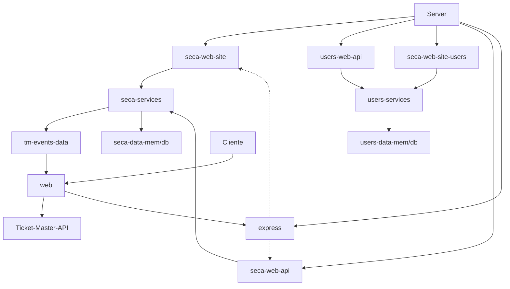

## Relatório

```txt
Trabalho realizado por:
- Pedro Malafaia nº49506
- Ricardo Cristino nº49413
```

#### Descrição da aplicação

Esta aplicação é dividida em quatro blocos principais. 
- Server: Responsável por iniciar todas as dependências e rotas, bem como aguardar por pedidos
- Web api: Responsável por pegar na informação contida nos pedidos e enviar essa informação para os services
- Services: Responsável por fazer as operações necessárias e enviar para ser guardado posteriormente em data. É aqui também onde são lançados erros, caso estes existam.
- Data: Recebe informação dos services e guarda (tanto em memória como em base de dados).

As dependências de cada bloco são recebidas por parâmetro (objeto com as várias funções lá dentro). Deste modo torna-se mais fácil e intuitivo alterar as dependências se necessário, visto que todas as dependências estão concentradas apenas num ponto do código. O mesmo é possível observar no excerto de código em baixo:

```js
//import secaDataInit from './data/memory/seca-data-mem.mjs'
import secaDataInit from './data/elastic/seca-data-db.mjs'
//import usersDataInit from './data/memory/users-data-mem.mjs'
import usersDataInit from './data/elastic/users-data-db.mjs'
import tmDataInit from './data/tm-events-data.mjs'
import secaServicesInit from './services/seca-services.mjs'
import usersServicesInit from './services/users-services.mjs'
import secaWebApiInit from './web_api/seca-web-api.mjs'
import usersWebApiInit from './web_api/users-web-api.mjs'
import secaSiteInit from './web_site/seca-web-site.mjs'
import authUiFunction from './web_site/seca_web_site_users.mjs'

const secaData = await secaDataInit()
const tmData = tmDataInit()
const usersData = await usersDataInit()
const usersServices = usersServicesInit(usersData)
const secaServices = secaServicesInit(tmData, secaData, usersServices)
const secaApi = secaWebApiInit(secaServices)
const usersApi = usersWebApiInit(usersServices)
const secaSite= secaSiteInit(secaServices)
const authRouter = authUiFunction(usersServices)
```

Por exemplo, se pretende alterar o modo de armazenamento de dados de memória para elasticsearch, ou vice-versa, basta apenas alterar a diretoria de "secaDataInit" e de "usersDataInit".

Gráfico representativo das dependências de cada módulo da aplicação:



#### Design da base de dados

Para armazenamento de informação foi utilizado o elasticsearch. Apenas dois indices foram criados: "users" e "groups". O indice users guarda a informação sobre cada utilizador, nomeadamente o seu username, a sua password e o seu token. Já o indice groups guarda toda a informação acerca dos grupos criados, mais concretamente o seu nome, a sua descrição, o token do utilizador proprietário e os eventos que pertencem ao mesmo. Estes dois indices interagem entre sí na medida em que cada utilizador só pode fazer alterações (criar, apagar, editar e adicionar eventos) aos grupos que lhe pertencem.
Dessa forma, quando é realizado o login, só são apresentados os grupos para esse utilizador cujo token corresponde.

#### Documentação da API
 ```yaml
 openapi: 3.0.1
info:
  title: SECA API
  description: This is a simple shows and events API 
  contact:
    email: owner@mail.com
  license:
    name: Apache 2.0
    url: http://www.apache.org/licenses/LICENSE-2.0.html
  version: 1.0.0
servers:
  - description: Localhost server for testing API
    url: http://localhost:1906

security:
  - bearerAuth: []
tags:
- name: Events
- name: Users
- name: Groups
paths:
  /popularevents:
   get:
  tags:
    - Events
  summary: Get popular events
  operationId: getPopularEvents
  parameters:
    - name: s
      in: query
      description: Number of events to retrieve (default 30)
      required: false
      schema:
        type: integer
    - name: p
      in: query
      description: Page number (default 1)
      required: false
      schema:
        type: integer
  responses:
    '200':
      description: Successful response
      content:
        application/json:
          schema:
            type: array
            items:
              type: object
              properties:
                name:
                  type: string
                id:
                  type: string
                date:
                  type: string
                  format: date-time
                segment:
                  type: string
                genre:
                  type: string
        '400':
      $ref: "#/components/responses/400BadRequest"

  /events/:name:
    get:
      tags:
        - Events
      summary: Search events by name
      operationId: getEventsByName
      parameters:
        - name: name
          in: query
          description: Name to search for in events
          schema:
            type: string
          required: true
        - name: s
          in: query
          description: Number of events to return (default 30)
          schema:
            type: integer
            minimum: 1
          required: false
        - name: p
          in: query
          description: Page number (default 1)
          schema:
            type: integer
            minimum: 1
          required: false
      responses:
        200:
          description: List of events matching the search criteria
          content:
            application/json:
              schema:
                type: array
                items:
                  $ref: '#/components/schemas/Event'
        400:
          $ref: "#/components/responses/400BadRequest"

  /groups:
    get:
      tags:
        - Groups
      summary: List all groups
      operationId: getAllGroups
      security:
        - BearerAuth: []  
      responses:
        200:
          description: List of all event groups
          content:
            application/json:
              schema:
                type: array
                items:
                  $ref: '#/components/schemas/EventGroup'
        400:
          $ref: "#/components/responses/400BadRequest"

    post:
      tags:
        - Groups
      summary: Create group
      operationId: createGroup
      security:
        - BearerAuth: []
      requestBody:
        description: Details for creating a new event group
        required: true
        content:
          application/json:
            schema:
              $ref: '#/components/schemas/NewGroup'
        responses:
          201:
          description: Event group created successfully
          content:
           application/json:
             schema:
              $ref: '#/components/schemas/Group'
          400:
            $ref: "#/components/responses/400BadRequest"
  groups/{groupId}:
    get:
      tags:
        - Groups
      summary: Get details of a group
      operationId: getGroup
       parameters:
        - name: groupId
          in: path
          description: ID of the group to fetch 
          schema:
            type: integer
          required: true
      responses:
        200:
          description: success in fetching the group
          content:
            application/json:
              schema:
                $ref: '#/components/schemas/Group'
        400:
          $ref: "#/components/responses/400BadRequest"
        401:
         $ref: "#/components/responses/401Unauthorized"
        404:
          $ref: "#/components/responses/404NotFound"

    put:
      tags:
        - Groups
      summary: Edit group
      operationId: updateGroup
      security:
        - BearerAuth: []
      parameters:
        - name: groupId
          in: path
          description: ID of the group to be edited
          required: true
          schema:
            type: integer
      requestBody:
        description: Updated details for the event group
        required: true
        content:
          application/json:
            schema:
              $ref: '#/components/schemas/NewEventGroup'
      responses:
        200:
          description: Event group updated successfully
          content:
            application/json:
              schema:
                $ref: '#/components/schemas/EventGroup'
        400:
          $ref: "#/components/responses/400BadRequest"
        404:
          $ref: "#/components/responses/404NotFound"

    delete:
      tags:
        - Groups
      summary: Delete a group
      operationId: deleteGroup
      parameters:
        - name: groupId
          in: path
          description: ID of the group to be deleted
          schema:
            type: integer
          required: true
      responses:
        200:
          description: Event group deleted successfully
          content: {}
        400:
          $ref: "#/components/responses/400BadRequest"
        404:
          $ref: "#/components/responses/404NotFound"
  groups/{groupId}/events:
   post:
      tags:
        - Groups
      summary: Add an event to a group
      operationId: addEventToGroup
      security:
      - BearerAuth: []
      parameters:
        - name: groupId
          in: path
          description: ID of the group to add event
          schema:
            type: integer
          required: true
      requestBody:
        description: Details of the event to add
        content:
          application/json:
            schema:
              $ref: '#/components/schemas/NewEvent'
        required: true
      responses:
        201:
          description: Event added to the group successfully
          content: {}
        400:
          $ref: "#/components/responses/400BadRequest"
        401:
         $ref: "#/components/responses/401Unauthorized"
        404:
          $ref: "#/components/responses/404NotFound"
  groups/{groupId}/events/{eventID}:      
    delete:
      tags:
        - Groups
      summary: Remove an event from a group
      operationId: deleteEventFromGroup
      parameters:
        - name: groupId
          in: path
          description: ID of the group to remove event
          schema:
            type: integer
          required: true
        - name: eventId
          in: query
          description: ID of the event to remove from the group
          schema:
            type: integer
          required: true
      responses:
        200:
          description: Event removed from the group successfully
          content: {}
        400:
          $ref: "#/components/responses/400BadRequest"
        401:
         $ref: "#/components/responses/401Unauthorized"
        404:
          $ref: "#/components/responses/404NotFound"

  /users:
     post:
      tags:
        - Users
      summary: Create new user
      operationId: createUser
      requestBody:
        description: Details for creating a new user
        content:
          application/json:
            schema:
              $ref: '#/components/schemas/NewUser'
        required: true
      responses:
        201:
          description: User added
          content:
            application/json:
              schema:
                type: object
                properties:
                  username:
                    type: string
                    example: user
        400:
          $ref: "#/components/responses/400BadRequest"
```

#### Intrução dos passos para correr a aplicação

1. Dar clone ao projeto e abrir no editor à escolha.
2. No terminal inserir o comando "npm install" para instalar todas as dependências necessárias para o funcionamento da aplicação.
3. Instalar o elasticsearch e no ficheiro config/elasticsearch.yml colocar xpack.security.enabled a false. De seguida correr a base de dados com bin/elasticsearch.bat.
4. Para iniciar o servidor, utilizar o comando npm start. Para iniciar o servidor em modo de desenvolvimento (reiniciar após cada alteração num ficheiro) utilizar o comando npm run start-dev.
5. Para correr os testes desta aplicação utilizar o comando npm test 

